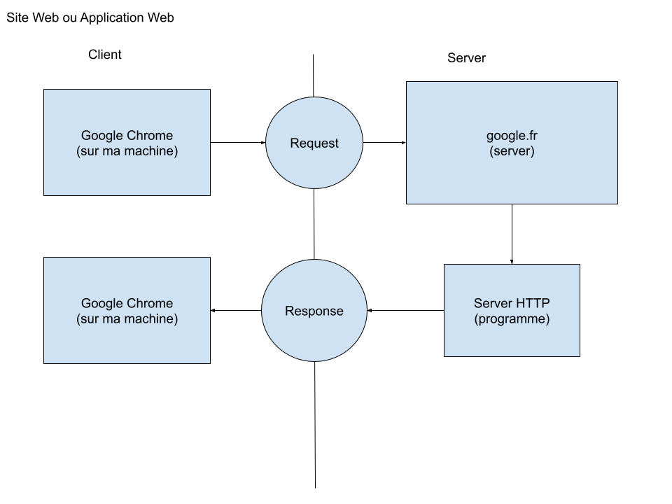

# Présentation de Symfony

Symfony est un framework PHP (un ensemble de librairies PHP fournissant
un cadre de travail) afin de développer des sites ou applications
web.

Symfony utilise PHP afin de pouvoir mettre un place des **server logique
HTTP** et répondre à des requêtes en réponse.

## Le client et le server



## Le server Physique et Logique


## L'URL


# Prérequis avant l'installation de Symfony

Afin de pouvoir installer symfony il faut au préalable installer
[composer](server_logique_physique) ainsi que [Symfony CLI](https://symfony.com/download).

# Créer un projet symfony

Afin de créer un projet symfony il faut tout simplement se rendre
dans le répertoire souhaité et lancer la commander suivante :

```bash
symfony new nom_du_projet --full
```

Cette commande créer le répertoire `nom_du_projet` avec tout ce qu'il
faut pour commencer un projet symfony !

Vous pouvez dès lors vous rendre dans le répertoire et lancer VSCode :

```bash
cd nom_du_projet
code .
```

# Les extensions VSCode utiles

-   [Editor Config](https://marketplace.visualstudio.com/items?itemName=EditorConfig.EditorConfig)
-   [PHP Companion](https://marketplace.visualstudio.com/items?itemName=blanc-frederic.vs-phpcompanion)
-   [PHP Intelephense](https://marketplace.visualstudio.com/items?itemName=bmewburn.vscode-intelephense-client)
-   [PHP Namespace Resolver](https://marketplace.visualstudio.com/items?itemName=MehediDracula.php-namespace-resolver)
-   [REST Client](https://marketplace.visualstudio.com/items?itemName=humao.rest-client)
